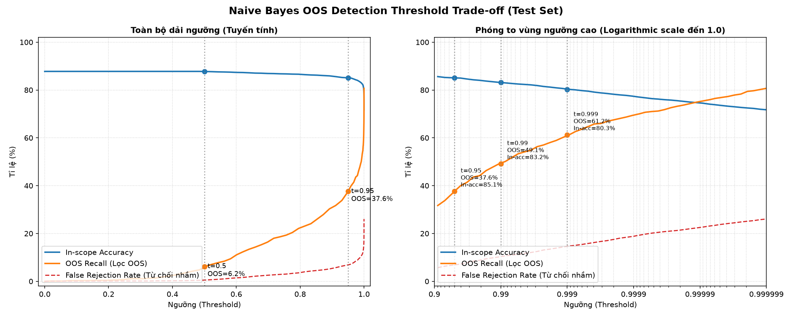

=== BẢNG SỐ LIỆU — [NaiveBayes] ===

Train Accuracy  : 98.51%
Val Accuracy    : 87.70%
Test Accuracy   : 87.78%
Overfit gap     : 10.81% (train - val)

Macro F1        : 0.8757
Macro Precision : 0.8831
Macro Recall    : 0.8778

Training Time   : 0.6264 s
Inference Time  : 0.0280 ms/câu
Model Size      : 6.1330 MB

Nhận xét tổng quan:
Đánh giá trên tập test của CLINC150 (4.500 câu in-scope, 150 lớp), chế độ phân loại thuần (threshold = 0):
- Overfit Gap ở mức trung bình khá (10.81%), thể hiện sự ổn định và khả năng khái quát tốt trên dữ liệu mới (Test Accuracy đạt 87.78% so với Val Accuracy 87.70%).
- Chất lượng phân loại đồng đều giữa 150 lớp (Macro F1 đạt 0.8757).
- Hiệu năng vận hành vượt trội với tốc độ dự đoán cực nhanh (0.0280 ms/câu) và dung lượng siêu nhẹ (6.13 MB).

Top 5 confused pairs:
1. change_user_name → change_ai_name  (10 lần)
2. rewards_balance → redeem_rewards  (9 lần)
3. calendar → calendar_update  (8 lần)
4. ingredients_list → recipe  (8 lần)
5. traffic → directions  (8 lần)

=== PHÂN TÍCH OOS DETECTION ===

Confidence trung bình:
| Loại dữ liệu | Confidence |
|---|---|
| In-scope | 0.9812 |
| OOS | 0.8864 |

Nhận xét:
- Độ tự tin (confidence) trung bình của Naive Bayes rất cao cho cả In-scope và OOS, điều này do tính chất phân phối xác suất của Multinomial Naive Bayes sau khi qua hàm Softmax thường nghiêng mạnh về lớp chiếm ưu thế.
- Khoảng cách phân biệt giữa In-scope và OOS thông qua confidence khá hẹp (0.9812 so với 0.8864), đòi hỏi việc chọn threshold lọc OOS phải cực kỳ cẩn thận.

Biểu đồ phân tích Trade-off:

